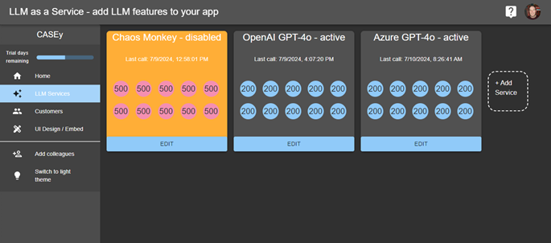
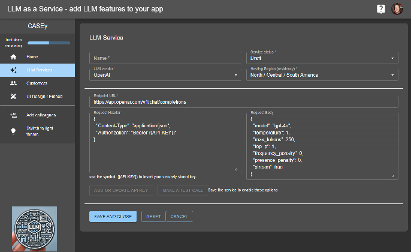
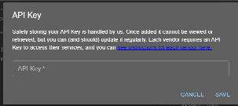
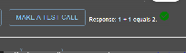

# LLMAsAService.io for Client Side Code

Website: ([www.llmasaservice.io](https://www.llmasaservice.io))
Control panel: ([app.llmasaservice.io](https://app.llmasaservice.io))
A product by CASEy, Inc ([heycasey.io](https://heycasey.io))

## What is LLMAsAService.io?
Implementing AI LLM features into application is relatively easy using a vendors API. When we were building our product ([heycasey.io](https://heycasey.io)) we had a number of reliability and financial risk issues. We solved these, and decided to make our platform for managing LLM's available as a service. 

The main features are -
- Streaming responses to give near immediate customer results and feedback
- Abort and Cancellation of streaming responses
- Multiple vendors with load-sharing and failover when (not if) they have outages
- Response caching for identical requests withing a given timeframe
- Secure storage of API keys from one portal
- Customer token budgeting and management (give trial users an amount of tokens to start with) - 0 to inhibit new customers
- Customer data tenancy - customer requests can be routed to certain LLM providers and regions based on their settings (Eg. EU customers)
- PII redaction. Clever tokenization of common PII data so no LLM vendor gets private information. Those tokens are replaced on return to the customer so the who redaction is transparent.
- Call analytics - request success or errors, count, and token usage
- Call analytics - country and region for security analysis (why are we getting a heap of requests from North Korea?)
- Load shedding - if traffic increases beyond allocated vendor capacity limits, some customers can be rejected based on their allocated "Tier"

There are two parts of using this service. The control panel at ([app.llmasaservice.io](https://app.llmasaservice.io)), and this library for connecting our service to your client side application.

Using all of your LLM services with the above features becomes as simple as -

```typescript
import { useLLM } from 'useLLM';

...
const {send, response, idle} = useLLM({project_id: "[your LLMAsAService project id]"}); // get the project_id from the Embed page in the control panel

...
const handleChatClick = () => {
    send("What is 1+1="); // calls the LLMs for a streaming response
};

// the response is streamed back and can be shown where needed
return (
    <div>
       <button onClick={handleChatClick} disabled={!idle}>
         Call Chat
       </button>
    
       <div>{response}</div>
    </div>);
```

## Step 1 - Register for a LLMAsAService account
1. Register at  ([app.llmasaservice.io](https://app.llmasaservice.io)) and confirm your email address
2. You will be prompted after first login to create a project (and accept privacy and terms)

## Step 2 - Create your LLM Service Providers
You can create any number of LLM Vendor service endpoints. The active services will be load balanced and used for failover if any vendor has an outage or is usage limited. You will ideally have at least two active at all times for reliable failover. You can also create a Chaos Monkey service that will randomly fail calls to prove that failover is effectively working.

The settings you need are the same settings you would pass to the vendor using their API. We make those calls on your behalf from our servers after confiming those requests are allowed.

After logging into the control panel, choose LLMServices from the right panel menu



1. Click the Add Service box to create your first or another LLM Service Endpoint



2. Name and choose your Vendor. We will boilerplate that vendors endpoint URL, header and body as a starting point. These will vary based on your needs and the vendor chosen (we are documenting each vendor now, until then email us if you have difficulty). Tip: We use the streaming features for each vendor. So, make sure that the streaming options are enabled. For example, for OpenAI add these at the end of the rest of the body JSON:

```javascript
{
    .... ,
   "stream": true,
   "stream_options": {"include_usage": true}
}
```

3. The inputs are validated. Main requirements is that the header and body are validated JSON inputs, and quotes for the parameters names and values are necessary with no ending comma before end brace characters eg. 

Good:
```javascript
{
  "Content-Type": "application/json",
  "Authorization": "Bearer {{API-KEY}}"
}
```

Bad (no quotes on names, and trailing , before ending brace):
```javascript
{
  Content-Type: "application/json",
  Authorization: "Bearer {{API-KEY}}",
}
```
4. The {{API-KEY}} should be used where the API key should go. DO NOT! DO NOT! DO NOT! hardcode your API keys into the LLM Service form. We will check that the placeholder is used.
5. Click Save and Close. The next step is mandatory before these services will work.
6. Click on the Edit button for the new service. The Add or Update API Key and Test buttons will now be enabled. Click **Add or Update API Key**
7. We properly encrypt and save your API key (we cannot retrieve it for you, if lost, create a new key from your vendor). Get the API key from your LLM Vendor's developer control panel and paste it into the dialog box and click Save. (one of the advantages of using LLMAsAService is that safe key management is in one place, we found this convenient and safer than using command line tools and config files)



8. Make a test call. Click the **Test Call** button and confirm you get a response



Repeat those steps for your other providers and configurations (one n north america, one in the EU, one for Azure or Anthropic, etc.)

## Step 3 - Add the useLLM to your project code

To enable the LLM features in your application we provide a react HOC and a hook. These client side components connect your app to the LLMService backend.

1. Import our client side library (UI components coming soon in a different package, this package has no dependencies and we want it that way)

```command
npm i llmasaservice-client
```
(or the yarn equivalent)

2. Instantiate the hook and the HOC (optional)

```typescript

/** used without HOC **/
import { useLLM } from 'useLLM';
const {send, response, idle} = useLLM({project_id: "[your LLMAsAService project id]"}); // get the project_id from the Embed page in the control panel


/** using the HOC **/
  //Index.tsx or App.tsx or similar, enclose the App inside the LLMServiceProvider
  import { LLMServiceProvider } from "useLLM";

  <LLMServiceProvider project_id="[your LLMAsAService project id]">
    <App />
  </LLMServiceProvider>

  // inside your component pages
  import { useLLM } from 'useLLM';
  
  const {send, response, idle} = useLLM();

```

3. Pass the customer making the call. If you wan to track and grant tokens to certain customers, you can pass them by a unique key (you choose, but must be encodedable in JSON, we use a UUID) and an customer identifying name. Tip: pass the customer at the level you want to track. A company id will allow all users for that company to be controlled as a group. We also don't want any PII. So, don't use an email address, we don't need it, and its another siurce of PII data leakage neither of us want.

```typescript

/** used without HOC **/
import { useLLM } from 'useLLM';
const {send, response, idle} = useLLM(
    {
        project_id: "[your LLMAsAService project id]", // get this from the Embed page in the control panel
        customer: {
            customer_id: "[your unique customer identifier]", // don't use email please. 
            customer_name: "[a way of humans identifying this customer in the control panel]" 
        }
    });


/** using the HOC **/
  //Index.tsx or App.tsx or similar
  import { LLMServiceProvider } from "useLLM";

  <LLMServiceProvider 
        project_id ="[your LLMAsAService project id]", // get this from the Embed page in the control panel
        customer = {
            customer_id: "[your unique customer identifier]", // don't use email please. 
            customer_name: "[a way of humans identifying this customer in the control panel]" 
        }>
    <App />
  </LLMServiceProvider>

  // inside your component pages
  import { useLLM } from 'useLLM';
  
  const {send, response, idle} = useLLM();

```

## Step 4 - Adding Chat features to your application

Calling **send** makes a secure call to LLMAsAService where a response is marshalled back from the providers. That response is in the **response** property. 

We have pre-built UIs in the works, but for now, you can call send and display the response wherever needed. An additional property **idle"" can be used to disable the send buttons when a response is ongoing. It will be true when idle, false when busy.

We also accept Abort functionality, and are in the process of documenting that now. If you need it email help@heycasey.io and we'll sort you out.
